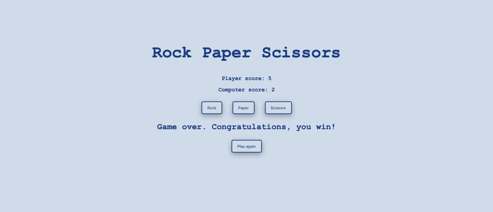

# Rock-Paper-Scissors

## Project overview

- Description: A simple rock, paper, scissors game where the player completes againts the computer
- Technologies: JavaScript, HTML, CSS

## Game features

- Tracks and updates the score of both the player and computer after each round
- After either the player or computer reaches a score of 5 points, the game will display a message and announce the winner
- Upon announcing a winner, the game will also display a button that allows the player to restart and play a new game
- Compatible with most mobile devices thanks to utilizing `flexbox`

## How to start the game

 - To run the game use this [link](https://popovdn.github.io/Rock-Paper-Scissors/)
 - You can also clone the repository locally and run the code on local dev server or open the `index.html` file in a browser

## How to play

1. Click one of the buttons to make your choice betweem Rock, Paper, or Scissors
2. The result of the current round will be displayed on the page
3. The first to reach 5 points wins the game
4. If you want to start a new game, click on the `Play again` button that will show up after a winner is announced

## Core functions

- `playRound(playerChoice, computerChoice)`: Determines the winner for each round
- `getComputerChoice()`: Randomly selects the computer’s choice.
- `updateScore()`: Updates the score after each round, keeps track of when to end the game and display the `Play again` button
- `displayGameResult()`: Announces the winner
- `startNewGame()`: Resets the game and hides the `Play again` button

## A screenshot of the game

